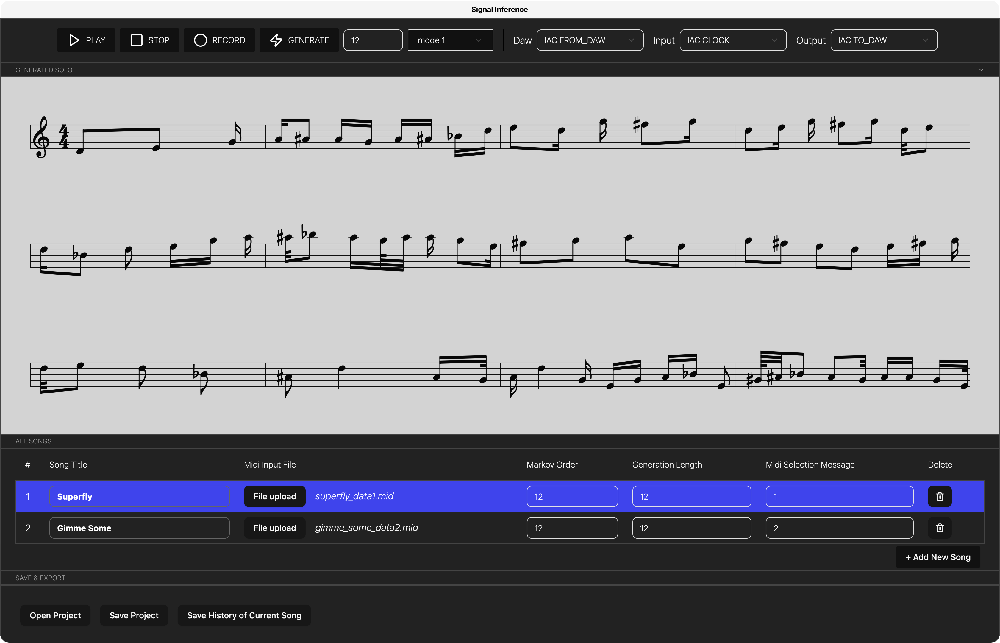

# Signal Interference

Signal interference is an application used to generate solos with AI. The application is controlled from a DAW using MIDI and has a build in sequencer which responds to an ecxternal midi clock. To use the application a song or multiple songs can be created. The song requires training data to work. After this this training data can be used to generate new musical phrases based upon recorded input.

## Developmnent

The application is an electron based nodejs application with a React front-end.

### Requirements
 - Nodejs version 24 or above: https://nodejs.org/en/download
 - A DAW with MIDI compatability. We recommend using Ableton Live: https://www.ableton.com/en/

### Installation
Installation can be done using [mise](https://mise.jdx.dev/) by running the command: ``mise i``

After this npm needs to install packages which can be done by running: ``npm i``

### Running the application
The application can be run by using the following command: ``npm run start``

### How to use the application 

#### Top section: Generation & MIDI setup 
    - PLAY: Play generated solo
    - STOP: Stop generated solo from playing 
    - RECORD: Record your own solo to be used by the model. 
    - GENERATE: Generate a solo with numbers of bars to generate
    - TIMING: Set timing correction in OFF (no timing correction), MODEL 1 (small timing correction), MODEL 2 (bigger timing correction). If you feel that the model is producing a solo's where the timing of the solo's seem a bit off, use this to correct the offset. 
    - DAW: This port receives MIDI CLOCK & CC messages from Ableton
    - INPUT: This port receives incoming MIDI messages from a MIDI keyboard/instrument. Because the naming is different per instrument, we will futher refer to it as: [INPUT PORT].
    - OUTPUT: This port sends outgoing MIDI messages (generated solo) to a DAW or instrument. Also this naming depends on your situation. For now, We will refer to this as [OUTPUT PORT]

#### Middle section: ABC notation of current generated solo (not 100% accurate) & Songs
    - Song title: Type your song title here
    - Midi input file: Select a .mid file from your computer that contains the MIDI data you want to use; for guidance on preparing the dataset, see the Recommended Workflow section. 
    - Markov Order: This controls how many previous notes the model considers when generating new ones: a higher value (for example, 12) produces solos that are more predictable and structured, while a lower value (such as 2) results in solos that are less predictable and more varied.
    - Generation length: The generation length specifies the number of bars the model will create in the output.
    - MIDI selection message: This is a CC control message used in Ableton to reference a specific song. For details on integrating MIDI messaging with your DAW, see the Recommended Workflow section.
    - Delete button: Delete the song 

#### Bottom section: Open and Save
    - Open project: Open a Signal Inference Project
    - Save project: Save a Signal Inference Project
    - Save current history of project: This will save the generated solo's 

### Recommended workflow
1. Collect MIDI training data
To generate a solo, the markov model requires a substantial amount of training data to capture your playing style. We recommend recording solos without chords in Ableton Live and exporting them as a single MIDI file. You can also use the trainingsdata midi file (included in the assets folder and performed by Jeroen Ermens) to get started right away. For best results, provide a MIDI file containing around one hour of solo material for a specific song, though effective results can already be achieved with as little as 15 minutes of MIDI data.

2. Install and run the application
Follow the steps in Requirements, Installation and Running the applicaiton described above.

3. Integrate MIDI messaging with Ableton Live (MacOS)
To use Signal Inference in a live setting, you can connect it to your existing Ableton Live set via MIDI. The first step is to ensure that Ableton is properly configured to communicate with Signal Inference over MIDI. Follow these steps:

    1. On your Mac navigate to Audio MIDI Setup. Click on your IAC driver, and create 3 ports named: CLOCK, TO_DAW, FROM_DAW. Click on Apply and go back to Ableton Live
    2. In Ableton Live go to Settings > Link, Tempo, Midi and select the following boxes:
        - For Midi Inputs, select for your [INPUT PORT]: Track, Sync, Remote, MPE
        - For Midi Output, select for for TO_DAW: Track, Sync and select for [OUTPUT PORT]: Track
    3. Go into arrangement view and insert a new MIDI track and name it MIDI_TO_SIGNAL_INFERENCE. This MIDI track will be used to send all commands to the application. Instead of "No Ouput", select IAC (FROM DAW) as output channel
    7. In the Clip View of this channel, you can add envelopes (you don't have to add notes!) by clicking on Envelopes. 
    
Signal Inference uses the following MIDI CC messages to generate solos. This cheat sheet will guide you through integrating them step by step into your Ableton Live set by assigning the CC values to envelopes.

    CC message: 32 -> Start recording
    Set this message at the beginning of any solo you play and record if you want to use it as training data for the AI to generate from. 

    CC message: 33 -> Stop recording
    Set this message at the end of your solo—or at the start of the AI-generated solo—to stop the recording.

    CC message: 40 -> Generate solo
    Set this message immediately after CC message 33, at the point where you want the AI solo to begin generating. The value of this CC message is the amount of bars that you want to generate. This value is passed on to the application. 

    CC message: 48 -> Start playback
    Set this message immediately after CC messages 33 and 40, at the point where you want the AI solo to begin playback of the generated solo.

    CC message: 49 -> Stop playback
    Not required, but can be used if you want to stop the playback before the amount of bars that is played is not finished yet.

    CC message: 56 -> Swith song. 
    Set this CC message at the start of a song. This ensures the track will switch to the right song. This value of this message correspongs to the MIDI Selection message that you set for each song in the Songs tab of the applicaiton. For example: Song "Greem Unions" has a MIDI selection message of 1, then the MIDI CC control message of this song should be set at the start of the this song and should have a value of 1. 

Dragging an envelope up or down changes the value of a CC message. For certain CC messages, the value itself has a specific meaning (for example, the number of bars to generate or the song being selected). If no specific meaning is indicated, setting the value to 127 (to send the message once) and then returning it to 0 is sufficient. Using this technique, you can create a short “block” signal to trigger the message. 

Apply the CC messages at every point where you want Signal Inference to generate solos. Once connected, you’ll see the incoming MIDI messages reflected in the interface: the Play, Generate, and Record buttons will turn blue when triggered, and the song selection in Signal Inference will automatically update (highlighted in blue) when another song is played in Ableton.

Are you working with a Ableton Live set from scratch? We recommend you to make a separate click track with the correct BPM for each song, and backingtrack to give context to the solo's that are being generated. Check out the example how that is done. 

Check out the example Ableton Live set (in /assets/example). You can use this in combination with the c (also in /assets/example) to see how the MIDI connections are set up.

4. Play with Signal Inference: 
Once you’ve set up all your MIDI commands in Ableton, most of Signal Inference’s core functionality will be ready to use. From there, you can refine the output by tweaking parameters, experimenting with different training datasets, and applying timing corrections. When you’re happy with the results, save the model for future use.

### Releasing the application
Application releases are build manually. To create a manual release, please update the version number in package.json and run the following command: ``npm run package``

### Structure
The application has a basic file structure for electron application developmen. The top level file structure is:
 - package.json: The pacakge file for the application
 - mise.toml: mise version file
 - src: source folder containing all the code.
 - assets: assets folder, provides test midi data and some test files, as well as static assets like images and icons.

The src folder is split up in 4 main folder for the application:
 - main: This contains the code for the electron back-end (everything running locally on the machine).
 - preload: The preload script which is specific to electron
 - renderer: This contains all the front-end code for electron.
 - utils: utillity functions which are used throughout the code base.

