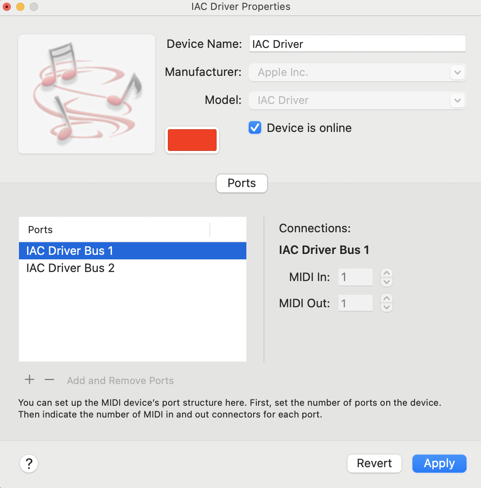

# Open Culture Tech

## Description
Let people know what your project can do specifically. Provide context and add a link to any reference visitors might be unfamiliar with. A list of Features or a Background subsection can also be added here. If there are alternatives to your project, this is a good place to list differentiating factors.

## Installation Python libraries
Make sure you have the [Python](https://www.python.org/downloads/) and [pip](https://pypi.org/project/pip/) installed. 

Create a virtual environment in your desired folder. Run the following in the command line interface (terminal)

```
cd <your desired folder>
python -m venv open-culture-tech
```

Activate your environment
```
source markov-midi-env/bin/activate
```

Install the necessary Python libraries
```
pip install mido pretty_midi music21
```

## Configuration Audio_MIDI_Setup (only MacOS)
On your Macbook go the the application Audio_MIDI_Setup. This application is a macOS utility that manages and configures audio and MIDI devices on your Mac. It allows you to configure audio input and output devices, set up MIDI devices, and create virtual MIDI connections.

In the Audio MIDI Setup, click on the IAC Driver. The IAC Driver (Inter-Application Driver) is a virtual MIDI device that is installed by default on all Mac OS X installations

In the IAC Driver create two ports with the names: 
- IAC Driver Bus 1
- IAC Driver Bus 2

Check mark "Device is online" 

Configuration should look like this <br>


Click on "Apply" to save.

You are now ready to move to Ableton to set up your preferences there

## Configuration Ableton Live 11/12

From the "ableton live sets" folder, open "open-culture-tech.als". This Ableton Live set already has the correct MIDI In's and Out's configured. Usually you have to set the Audio Settings in Ableton. Go to Live > Settings > Audio. Here set the Audio Output Device to either your headphones or to your MacBook speaker.

## Usage
To run the experiment properly follow these steps, assuming the previous installations and configurations have been executed properly.  

1. In the cli run:

```
cd <your folder of your virtual environment>
```

```
source markov-midi-env/bin/activate
```

```
cd <your saved cloned repo>
cd <markov_experiments_oct>
```

We will first make sure the begeleiding (chords) will be played at the exact same timing as your and the Markov AI solo. We will send a MIDI message of C0 to Ableton to make a mapping for this. You only have to do this once! 

Run:

```
python midi_mapper.py
```

Now the midi mapping is made, you can execute the experiment. 

```
python polyphonic_markov_chain2.py
```

To exit the interaction loop, hit CTL + C

## Authors 
Eva van der Born
Jort Band

## License
?

## Project status
WIP